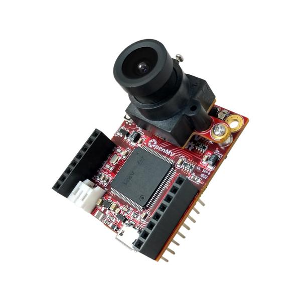
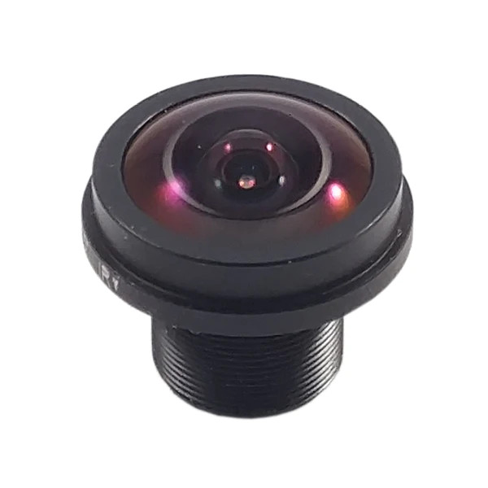
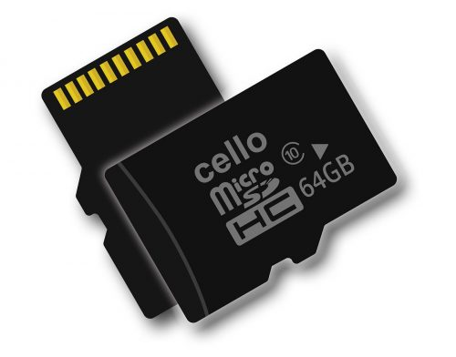
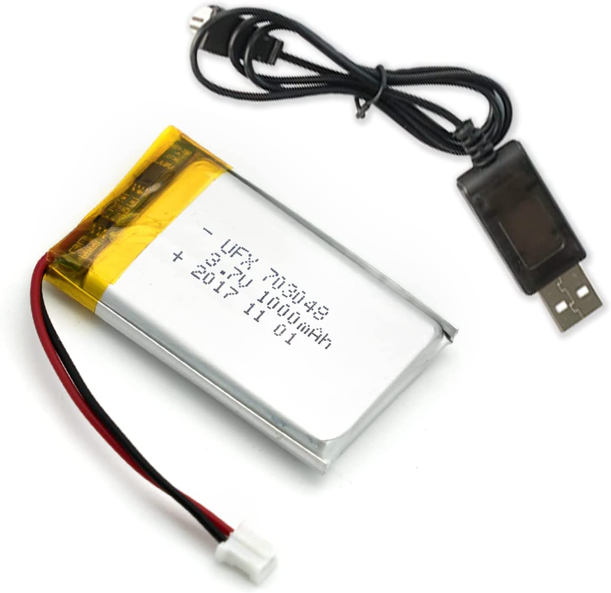
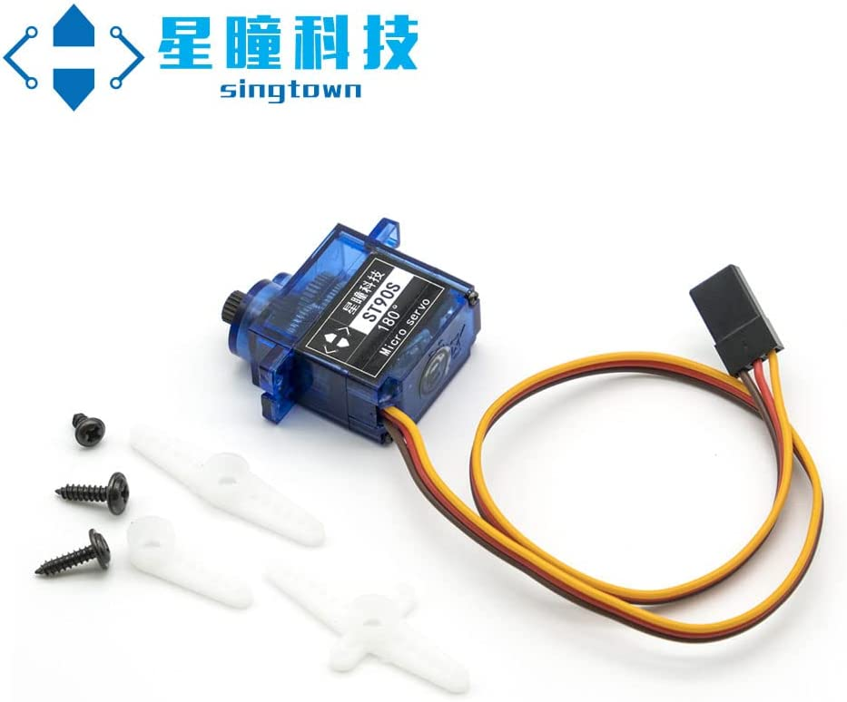
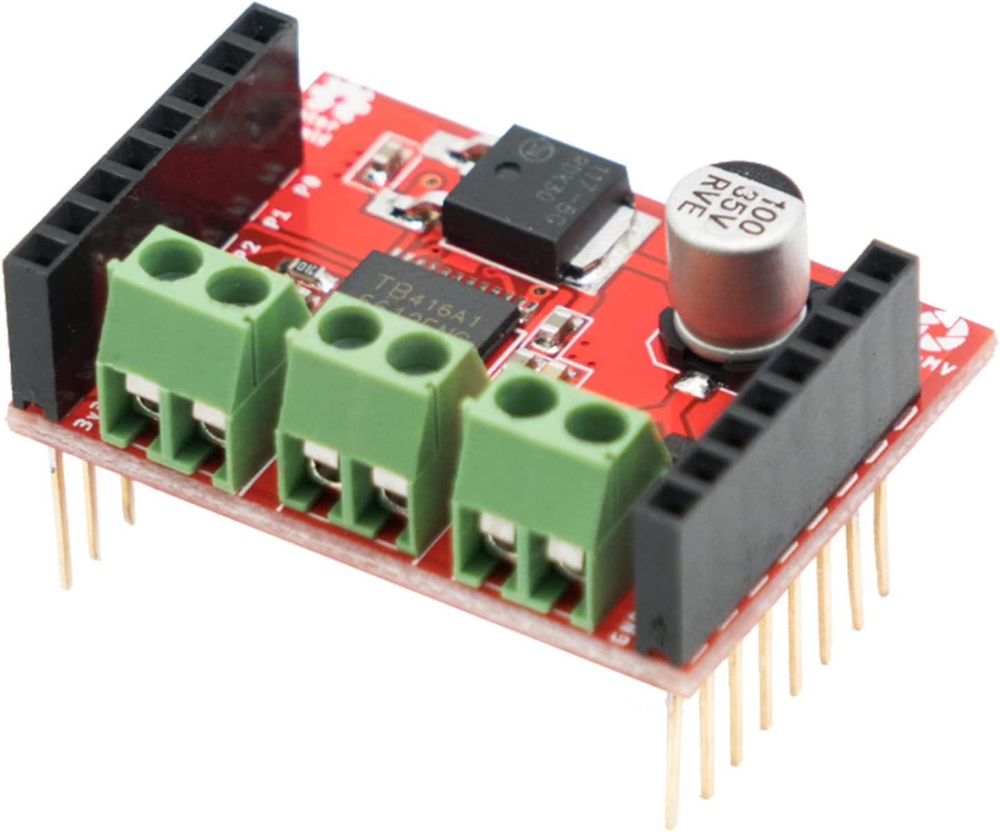
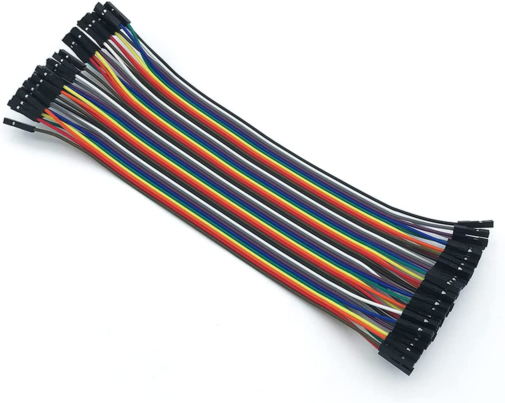
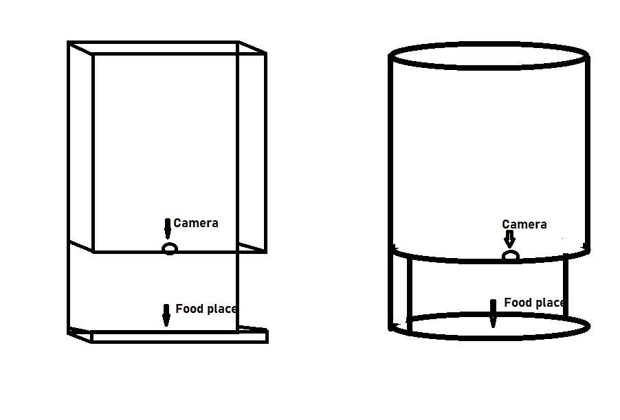
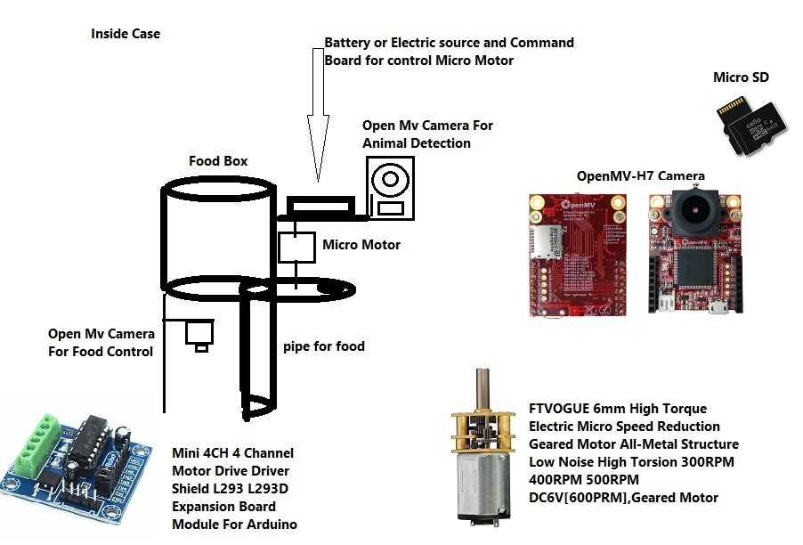

# Cat Dog Food Detector

## This project is for feeding a dog or cat when the animal is placed in front of the device

### Intorduction

This is a project for municipalities, animal care institutions and NGOs to protect the environment and animals
In this project, using computer vision and machine learning, the device can feed the animal by recognizing which animal is in front of the device and whether there is food or not.
In this project, a step motor is designed to pour food at the bottom of the device using the OpenMV camera and its boards.
Details are below

1. OpenMV Cam H7 R2 
2. Ultra Wide Angle Lens 
3. SD Card 
4. 3.7V Li Battery 100mAh + Charging Cable，
5. OpenMV Digital Servo 180° 9g ST90S 
6. OpenMV Motor Shield TB6612 
7. OpenMV Dupont Line Wire 40pin 20cm 

The device is a large tank of food for animals, under which there is a place for a motor camera and a tank for pouring food.

The food delivery and camera section includes a place to measure the meal and a camera to recognize the animal's face

